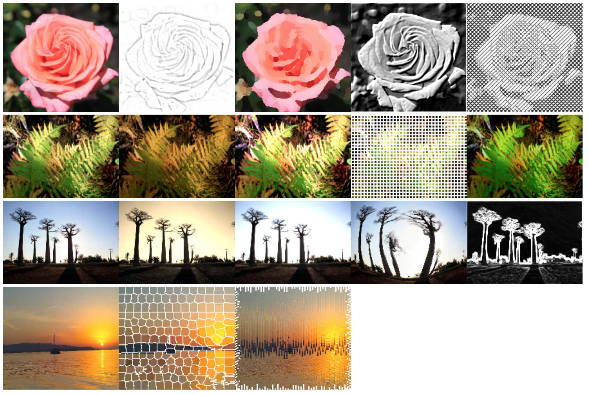

# image-util
A collection of Javscript image manipulation utilties and effects filters.





## Usage example

Given a `createCanvas` function.
```
const createCanvas = (img) => {
  const canvas = document.createElement('canvas');
  canvas.width = img.width;
  canvas.height = img.height;
  const context = canvas.getContext('2d');
  context.putImageData(img, 0, 0);
  return canvas;
};

```

Simple example of hatch-filter
```
const img = await loadImage('example.jpg', { width: 200, height: 200 });

// Cross-hatch effect
const hatch = hatchFilter(img, 1.0, 0.7, 0.5, 0.25);
const hatchCanvas = createCanvas(hatch);
document.body.append(hatchCanvas);

```

With CDN, showing composition of filters to create a dodge-burn effect

```
<script type="module">
import * as ImageUtil from "https://cdn.jsdelivr.net/gh/mwdchang/image-util@latest/dist/index.js"

const img = await ImageloadImage('example.jpg', { width: 200, height: 200 });

// Dodge burn effect
const burn = ImageUtil.dodge(
  ImageUtil.invertFilter(ImageUtil.uniformBlur(ImageUtil.greyScaleFilter(img), 8)),
  ImageUtil.greyScaleFilter(img)
);
const burnCanvas = createCanvas(burn);
document.body.append(burnCanvas);
</script>
```


## Build library
```
npm run build
```


## Run Examples
Runs on http://localhost:8090
```
npm run develop
```

## Filters and effects
### Convolution based
- sepia, polaroid, technicolour, kodakChrome, vintage, browni, gaussian-blur, uniform-blur, glow, sharpen, emboss, laplacian, sobel

### Effects
- dodge, grid, hatch, fishEye, painterly, SLIC, shear, sketching

